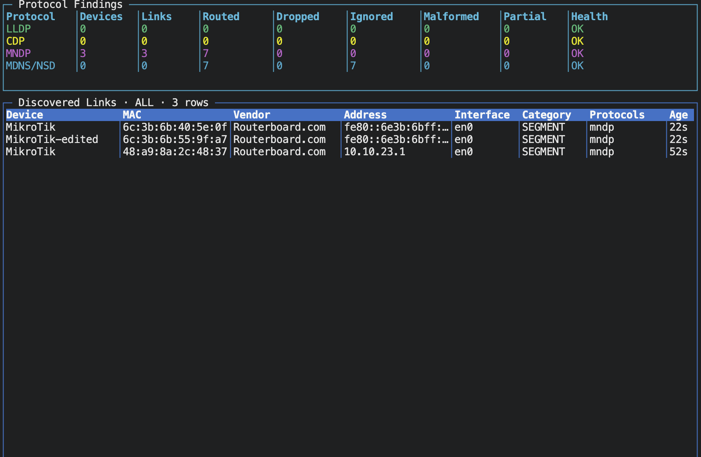

# omnidiscover

`omnidiscover` is a receive-only, zero-Cgo Go library for discovering and
correlating LLDP, CDP, MNDP, and mDNS/DNS-SD identities. It uses native capture
facilities rather than libpcap and never sends discovery queries or refresh
packets.

Android Network Service Discovery is supported through its standard DNS-SD over
mDNS mapping. The API exposes `ProtocolAndroidNSD`, `ProtocolsAndroidNSD`, and
`DecodeAndroidNSD` aliases, plus DNS-SD TXT lookup and Google Cast profile
recognition.



The canonical device view includes the best observed or directly claimed MAC,
an IEEE MA-S/MA-M/MA-L vendor assignment, hardware model, platform, software
version, and protocol-reported uptime. Locally administered MACs are shown as
private/randomized instead of being incorrectly assigned to a manufacturer.

## Platform support

| Platform | LLDP/CDP live capture | MNDP/mDNS live capture |
| --- | --- | --- |
| Linux | `AF_PACKET`, classic BPF, TPACKET_V3 with `recvfrom` fallback | Same raw path when L2 capture is enabled; UDP listeners otherwise |
| macOS | `/dev/bpf` with a reusable batched read buffer | Passive UDP listeners, including when the BPF L2 path is enabled |
| Windows | Offline decoder API only | Passive IPv4/IPv6 UDP listeners |

Linux raw capture requires `CAP_NET_RAW` or equivalent privileges. macOS LLDP
or CDP capture requires permission to open a BPF device. Requesting live LLDP or
CDP on Windows returns `*UnsupportedProtocolsError`; no external packet driver
is installed or required.

## Use

```bash
go get github.com/kmoz000/omnidiscover/pkg/omnidiscover
```

The callback API is the allocation-conscious core. Its `EventView` borrows
engine storage and is valid only until the callback returns.

```go
ctx, cancel := context.WithCancel(context.Background())
defer cancel()

engine, err := omnidiscover.New(omnidiscover.Config{
	Interfaces: []string{"eth0"},
	Protocols:  omnidiscover.ProtocolsAll,
})
if err != nil {
	log.Fatal(err)
}
defer engine.Close()

err = engine.Run(ctx, func(event omnidiscover.EventView) {
	name := event.Device.SystemName.Current()
	fmt.Printf("%v %s protocols=%#x link=%v\n",
		event.Kind, name, event.Device.Protocols, event.Link.Kind)
})
if err != nil && !errors.Is(err, context.Canceled) {
	log.Fatal(err)
}
```

The import path is `github.com/kmoz000/omnidiscover/pkg/omnidiscover`.
`Engine.Stream` returns owned event copies. It is easier to retain, but copying
allocates. Its bounded pending queue coalesces changes by link key and drops a
new key when full rather than blocking capture. `Engine.Snapshot` copies current
state into caller-reusable storage, and `Engine.Stats` exposes routed, ignored,
partial, malformed, and dropped packet counts together with high-water marks
and bounded-cache evictions.

All limits have bounded defaults and can be changed in `Config`: 4,096 devices,
8,192 links, 16,384 DNS records, four conflicting alternatives in addition to
the canonical value per logical field, 256 queued packets per protocol, 1,024
pending owned events, and 9,216 bytes per frame.

## Standalone decoding

Capture is optional. The reusable decoders are suitable for supplied frames,
files, tests, and Windows LLDP/CDP integrations:

```go
var msg omnidiscover.LLDPMessage
status := omnidiscover.DecodeLLDPFrame(frame, &msg)
if status.Usable() {
	fmt.Printf("chassis=%x port=%s\n", msg.ChassisID.Value, msg.PortID.Value)
}
```

The corresponding entry points are `DecodeEthernetFrame`, `DecodeUDP`,
`DecodeLLDPDU`, `DecodeLLDPFrame`, `DecodeCDP`, `DecodeCDPFrame`, `DecodeMNDP`,
`DecodeMDNS`, and the Android-oriented `DecodeAndroidNSD` alias. They
bounds-check before slicing, return structured `DecodeStatus` values, reuse
destination capacity, and never panic on malformed input. A status can be
clean, ignored, partial, or fatal; only fatal input increments the malformed
counter.

## Canonical field mapping

| Canonical field | LLDP | CDP | MNDP | mDNS/DNS-SD |
| --- | --- | --- | --- | --- |
| MAC | Observed Ethernet source; claimed chassis MAC retained separately | Observed Ethernet source | Direct MNDP MAC; observed Ethernet source when available | Observed Ethernet source when raw capture is available; otherwise fused only through direct IP/interface evidence |
| Vendor | IEEE assignment for the selected MAC | IEEE assignment for the selected MAC | IEEE assignment for the selected MAC | IEEE assignment only when a MAC is directly known |
| Model | No generic mandatory model TLV; no guessing from description | Platform TLV retained as model evidence | Board TLV, for example `RB952Ui-5ac2nD` | Service-profile data only when explicitly defined |
| Platform | Explicit structured evidence only | Platform TLV | Platform TLV, for example `MikroTik` | Not inferred from service or hostname |
| Software | Explicit structured evidence only | Software Version TLV | Version TLV | Profile-specific TXT remains service metadata |
| Uptime | Not defined by base LLDP | Not defined by base CDP | Uptime TLV, extrapolated between announcements | Not defined generically |

MNDP uptime refreshes within five seconds of the expected monotonic value update
the baseline silently. A reboot or larger clock discontinuity emits a device
change. This preserves fresh uptime without producing a redundant event for
every announcement.

## Example command

The repository includes a passive CLI with a refreshing `termui` dashboard.
The top table reports findings, drops, ignored traffic, malformed packets, and
partial decodes for each protocol. The discovery table shows MAC, IEEE vendor,
model/platform, uptime, and physical or segment link category; use `1`–`4`,
`p`, `s`, or `a` to filter it.

```bash
# Unprivileged UDP discovery on Linux, macOS, or Windows.
go run ./cmd/omnidiscover -protocols mdns,mndp

# Native LLDP/CDP plus UDP capture on one Linux interface.
sudo go run ./cmd/omnidiscover -interfaces eth0 -protocols all

# Native BPF LLDP/CDP plus UDP MNDP/mDNS capture on macOS.
sudo go run ./cmd/omnidiscover -interfaces en0 -protocols all

# Newline-delimited JSON for another process.
go run ./cmd/omnidiscover -interfaces en0 -protocols mdns -json -duration 30s

# Plain line output without the terminal dashboard.
go run ./cmd/omnidiscover -protocols mdns,mndp -plain
```

Use `go run ./cmd/omnidiscover -help` for all options. On Linux LLDP/CDP
requires `CAP_NET_RAW` or equivalent privileges; on macOS it requires access to
`/dev/bpf`. Windows intentionally supports live MNDP/mDNS only.

### Dashboard controls

| Key | Action |
| --- | --- |
| `a` or `0` | Show all discoveries |
| `1`, `2`, `3`, `4` | Filter LLDP, CDP, MNDP, or mDNS/NSD |
| `p`, `s` | Filter physical adjacency or segment presence |
| Arrow keys, `j`, `k`, Page Up, Page Down | Scroll |
| `g`, `G` | Jump to the beginning or end |
| `q` or Ctrl-C | Exit |

### Protocol counters

| Counter | Meaning |
| --- | --- |
| Devices | Current fused devices with evidence from the protocol |
| Links | Current physical or segment links with protocol provenance |
| Routed | Packets selected and delivered to that protocol decoder |
| Dropped | Newest packets discarded because the bounded protocol queue was full |
| Ignored | Valid traffic intentionally excluded, such as mDNS questions |
| Malformed | Fatal truncation, invalid lengths, unsafe compression, or other unusable input |
| Partial | A bounded decode produced usable data while rejecting an optional field |
| Health | `OK`, `DROPS`, or `MALFORMED` from the counters above |

### Passive mDNS and Android NSD

The mDNS path consumes response packets only. Questions arriving on UDP 5353
are normal network traffic and increment `Ignored`, not `Malformed`.
Omnidiscover never sends a question to solicit an answer, so an empty table can
simply mean that no service advertised during the observation window.

[Android Network Service Discovery](https://developer.android.com/develop/connectivity/wifi/use-nsd)
uses DNS-SD over mDNS. There is no generic Android marker in a DNS-SD record, so
omnidiscover does not label a device as Android based only on a hostname or
service name. It can correlate advertised services and recognizes the
[Google Cast discovery](https://developers.google.com/cast/docs/discovery)
profile `_googlecast._tcp.local`.
[Android Wi-Fi Aware/NAN](https://developer.android.com/develop/connectivity/wifi/wifi-aware)
is a separate, active radio-level API and is not captured by the passive IP or
Ethernet backends.

For a quick mDNS diagnostic without the terminal UI:

```bash
go run ./cmd/omnidiscover \
  -interfaces en0 \
  -protocols mdns \
  -duration 15s \
  -plain
```

For example, this is healthy passive traffic containing six questions and no
responses:

```text
stats: captured=6 routed=6 ignored=6 malformed=0 partial=0 dropped=0 events=0 output-dropped=0 devices-high=0 links-high=0 dns-high=0 evictions=0/0/0
```

If the dashboard still has no `Ignored` column, stop the old process and rerun
the command from the current checkout. The current header places `Ignored`
between `Dropped` and `Malformed`.

## Fusion and classification

One device may own multiple links. LLDP/CDP observations produce physical
adjacencies; MNDP/mDNS produce segment-presence links, which are promoted when
direct physical evidence later arrives. Identical refreshes update expiry but
do not emit duplicate events. Identity promotion requires directly agreeing
MAC/IP/interface evidence; names or payload-claimed identifiers alone never
merge devices.

Classification rules are compiled by `New`. Exact, protocol, capability, MAC
prefix, and IP prefix conditions are evaluated before regex predicates. Regex
uses Go's bounded-backtracking RE2 implementation and is never compiled in a
packet loop. The winner is deterministic by priority, predicate specificity,
then declaration order. No vendor classification database is built in.

## Design notes

- One bounded packet queue and one decoder goroutine are used per protocol.
- A single fusion goroutine owns live device, link, DNS, and timing-wheel state.
- Packet slots and long-lived records use explicitly bounded slabs and
  freelists; owned snapshots and stream events are outside the capture hot path.
- IEEE vendor lookup uses a 12-bit first-level index and bounded binary search,
  then applies 36/28/24-bit longest-prefix precedence without heap allocation.
- Ethernet routing directly dispatches EtherType, Cisco LLC/SNAP, or UDP port.
  Regex is never used to identify packets.
- mDNS questions, MNDP refresh requests, and locally transmitted BPF packets are
  ignored; omnidiscover does not actively probe the network.
- mDNS goodbye records and cache-flush announcements use RFC 6762's one-second
  rescue window; TTL-only refreshes update expiry without emitting changes.

The passive receive pipeline was informed by
[Linceo](https://github.com/MarcosGiojiho/linceo), while protocol interoperability
was compared with [grandcat/zeroconf](https://github.com/grandcat/zeroconf),
[oleksandr/bonjour](https://github.com/oleksandr/bonjour), and
[pjediny/mndp](https://github.com/pjediny/mndp). These projects are references,
not runtime dependencies.

## Development

Project layout:

```text
cmd/omnidiscover/     refreshing termui CLI, JSON, and plain output
pkg/omnidiscover/     public capture, decoder, fusion, and classification API
pkg/utils/            reusable allocation-conscious helpers
docs/protocols/       authoritative protocol references and checksums
utils/genoui/         IEEE registry compiler for static vendor lookup tables
```

The protocol reference index is in
[`docs/protocols/README.md`](docs/protocols/README.md). LLDP is standardized by
IEEE, CDP and MNDP are proprietary vendor protocols, and mDNS/DNS-SD are the
protocols defined by IETF RFCs 6762 and 6763.

The generated MAC registry is sourced from the official IEEE MA-L, MA-M, and
MA-S public listings. Its source digests and update procedure are documented in
[`docs/protocols/ieee-mac-registry.md`](docs/protocols/ieee-mac-registry.md).

```bash
CGO_ENABLED=0 go test ./...
go test -race ./...
go test -run '^$' -bench . -benchmem ./...
```

The decoder fuzz targets accept arbitrary bytes and assert that parsing remains
bounded and panic-free.

Current CPU and allocation results, including mDNS refresh fusion and IEEE
vendor lookup, are recorded in [`docs/benchmarks.md`](docs/benchmarks.md).

## License

MIT. See [LICENSE](LICENSE).
